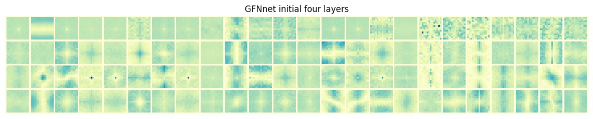

# SpectFormer Model for Image Classification

Created by [Badri N. Patro](https://badripatro.github.io/), [Vinay P. Namboodiri](https://vinaypn.github.io/), [Vijay Srinivas Agneeswaran](https://in.linkedin.com/in/vijaysrinivasagneeswaran)

## Abstract 

'''
Vision transformers have been applied successfully for image recognition tasks. There have been either multi-headed self-attention based (ViT \cite{dosovitskiy2020image}, DeIT, \cite{touvron2021training}) similar to the original work in textual models or more recently based on spectral layers (Fnet\cite{lee2021fnet}, GFNet\cite{rao2021global}, AFNO\cite{guibas2021efficient}). We hypothesize that both spectral and multi-headed attention plays a major role. We investigate this hypothesis through this work and observe that indeed combining spectral and multi-headed attention layers provides a better transformer architecture. We thus propose the novel Spectformer architecture for transformers that combines spectral and multi-headed attention layers. We believe that the resulting representation allows the transformer to capture the feature representation appropriately and it yields improved performance over other transformer representations. For instance, it improves the top-1 accuracy by 2\% on ImageNet compared to both GFNet-H and LiT. SpectFormer-S reaches 84.25\% top-1 accuracy on ImageNet-1K (state of the art for small version). Further, Spectformer-L achieves 85.7\% that is the state of the art for the comparable base version of the transformers. We further ensure that we obtain reasonable results in other scenarios such as transfer learning on standard datasets such as CIFAR-10, CIFAR-100, Oxford-IIIT-flower, and Standford Car datasets.  We then investigate its use in downstream tasks such of object detection and instance segmentation on MS-COCO dataset and observe that Spectformer shows consistent performance that is comparable to the best backbones and can be further optimized and improved. Hence, we believe that combined spectral and attention layers are what are needed for vision transformers.

'''


Our code is based on [pytorch-image-models](https://github.com/rwightman/pytorch-image-models), [DeiT](https://github.com/facebookresearch/deit), and [GFNet](https://github.com/raoyongming/GFNet).


## Model Zoo

We provide variants of our SpectFormer models trained on ImageNet-1K:
| name |  Params | FLOPs | acc@1 | acc@5 | 
| --- | --- | --- | --- | --- | 
| SpectFormer-T | 9M | 1.8G | 76.9 | 93.4 | 
| SpectFormer-XS |  22M | 4.0G | 80.2 | 94.7 |
| SpectFormer-S |  32M | 6.6G | 81.7 | 95.6 | 
| SpectFormer-B |  57M | 11.5G | 82.1 | 95.7 | 


## Filter Visualization

We visualize the learned filters initial  layers of GFNet-XS and SpectFormer-XS . 




### Requirements

- python =3.8 (conda create -y --name spectformer python=3.8)
- torch>=1.10.0 (conda install pytorch==1.10.1 torchvision==0.11.2 torchaudio==0.10.1 cudatoolkit=11.3 -c pytorch)
- timm (pip install timm)


**Data preparation**: download and extract ImageNet images from http://image-net.org/. The directory structure should be

```
│ILSVRC2012/
├──train/
│  ├── n01440764
│  │   ├── n01440764_10026.JPEG
│  │   ├── n01440764_10027.JPEG
│  │   ├── ......
│  ├── ......
├──val/
│  ├── n01440764
│  │   ├── ILSVRC2012_val_00000293.JPEG
│  │   ├── ILSVRC2012_val_00002138.JPEG
│  │   ├── ......
│  ├── ......
```

### Evaluation

To evaluate a pre-trained spectformer model on the ImageNet validation set with a single GPU, run:

```
python infer.py --data-path /path/to/ILSVRC2012/ --arch arch_name --model-path /path/to/model
```


### Training

#### ImageNet

To train spectformer models on ImageNet from scratch, run:

```
python -m torch.distributed.launch --nproc_per_node=8 --use_env main_spectformer.py  --output_dir logs/spectformer-xs --arch spectformer-xs --batch-size 128 --data-path /path/to/ILSVRC2012/
```

To finetune a pre-trained model at higher resolution, run:

```
python -m torch.distributed.launch --nproc_per_node=8 --use_env main_spectformer.py  --output_dir logs/spectformer-xs-img384 --arch spectformer-xs --input-size 384 --batch-size 64 --data-path /path/to/ILSVRC2012/ --lr 5e-6 --weight-decay 1e-8 --min-lr 5e-6 --epochs 30 --finetune /path/to/model
```

#### Transfer Learning Datasets

To finetune a pre-trained model on a transfer learning dataset, run:
```
python -m torch.distributed.launch --nproc_per_node=8 --use_env main_spectformer_transfer.py  --output_dir logs/spectformer-xs-cars --arch spectformer-xs --batch-size 64 --data-set CARS --data-path /path/to/stanford_cars --epochs 1000 --lr 0.0001 --weight-decay 1e-4 --clip-grad 1 --warmup-epochs 5 --finetune /path/to/model 
```

